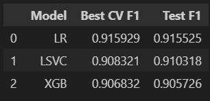

# 📨 Automatic Ticket Classification System

An end-to-end **NLP-based ticket classification project** that automatically categorizes customer complaints into predefined support categories using **topic modeling, machine learning, and a Streamlit web application**.

This project follows **industry-grade practices** using **Git + DVC + DagsHub** for full reproducibility.

---

## 📌 Project Overview

Customer support teams receive a large volume of complaints every day. Manually classifying them is:

- Time-consuming  
- Error-prone  
- Not scalable  

This system automatically:
- Classifies complaints into meaningful categories  
- Provides confidence scores for predictions  
- Supports multiple complaints at once  
- Offers a clean and interactive Streamlit UI  

---

## 🧠 Problem Statement

Given a customer complaint in text form, predict the most relevant category such as:

- Account Services  
- Credit Card or Prepaid Card  
- Mortgage / Loan  
- Theft / Dispute Reporting  
- Others  

---

## 🏗️ System Architecture

Raw Complaints
↓
Text Cleaning & Preprocessing
↓
TF-IDF Vectorization
↓
NMF Topic Modeling
↓
Supervised ML Models
↓
Best Model Selection
↓
Streamlit Web Application


---

## 🔍 Text Modeling Approach

### 1. Topic Modeling (Unsupervised)
- Algorithm: **Non-negative Matrix Factorization (NMF)**
- Input: TF-IDF vectors
- Purpose:
  - Discover latent complaint themes
  - Extract top keywords per topic
  - Help in meaningful topic labeling

### 2. Supervised Classification
After labeling topics:
- Complaint → TF-IDF → ML model → Category prediction

---

## 🤖 Models Used 

- Logistic Regression  
- Linear Support Vector Classifier (Linear SVC)  
- Random Forest  
- Decision Tree  
- Naive Bayes  
- XGBoost  

---

[!IMPORTANT]
**Model Exclusion:** Random Forest, Decision Tree, and Naive Bayes have been excluded to reduce notebook execution time and prioritize more efficient classifiers like Logistic Regression and Linear SVC.

## 📊 Model Performance Comparison

Evaluation was done using **Stratified K-Fold Cross Validation** and **Weighted F1-score**.

| Model | CV F1 Score | Test F1 Score |
|------|------------|---------------|
| **Logistic Regression** | **0.91** | **0.91** |
| Linear SVC | 0.90 | 0.91 |
| XGBoost | 0.90 | 0.90 |
| Random Forest | 0.84 | 0.84 |
| Decision Tree | 0.78 | 0.77 |
| Naive Bayes | 0.77 | 0.77 |

✅ **Final Selected Model:** Logistic Regression

---

## 🖼️ Model Score Visualizations

### Logistic regression(LR), LinearSVC(LSVC), Xgboost(XGB)


---

## 🌐 Streamlit Web Application

### Features
- Accepts multiple complaints at once
- Predicts category with confidence score
- Highlights low-confidence predictions
- Clean, professional UI

Run the app using:
```bash
streamlit run app.py
```

### 📂 Project Structure
```text
Ticketclassifier/
├── .git/                 # Git configuration
├── .dvc/                 # DVC configuration
├── Artifacts/            # Saved ML pipelines & artifacts
├── data/                 # DVC-tracked datasets
├── notebooks/            # Data preprocessing & training notebooks
├── app.py                # Streamlit app (main)
├── app_simple.py         # Minimal UI version
├── requirements.txt      # Project dependencies
├── README.md             # Project documentation
└── image.png             # Model score visualizations
```

📦 Tech Stack

- Python
- scikit-learn
- NMF (Topic Modeling)
- Streamlit
- DVC
- DagsHub
- Joblib

## 🔁 Reproducibility (DVC Workflow)
```bash
git clone <repo-url>
cd Ticketclassifier
dvc pull
pip install -r requirements.txt
streamlit run app.py
```

### 📈 Key Learnings

- Topic modeling helps understand data before labeling
- Logistic Regression is a strong baseline for text classification
- DVC enables reproducible ML pipelines
- Confidence scores are critical in real-world support systems

### 🚀 Future Improvements

- Use semantic embeddings (Sentence Transformers / LLM embeddings)
- Auto-generate topic labels using LLMs
- Add active learning for low-confidence predictions
- Extend to multi-domain ticket classification

### 👤 Author

**Sagar Pundir**
- BSc (Hons) Data Science & AI
- Interested in NLP, ML systems, and production AI workflows